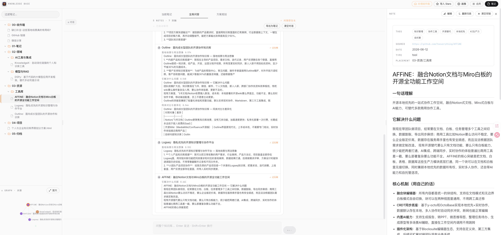
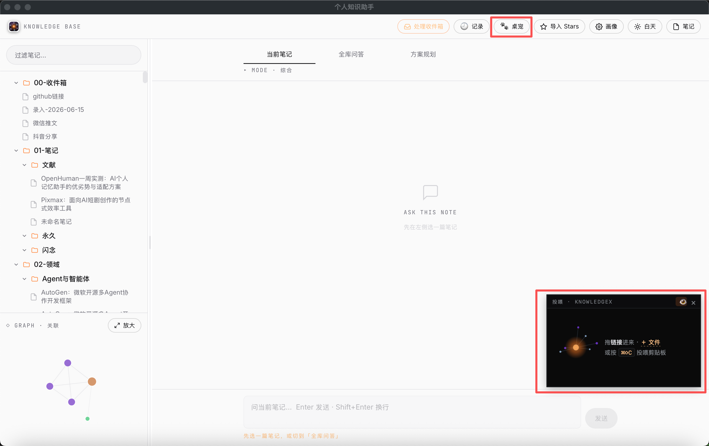

# KnowledgeX · 个人知识助手





把"收藏即遗忘"的链接，变成**自动消化、可问答、会生长**的个人知识库。

KnowledgeX 是一套自给自足的知识管道 + 问答应用：你把链接丢进收件箱，它自动抓取正文、用 LLM 按你的画像消化成结构化笔记并归位到对应领域目录；之后你可以对单篇笔记、整个知识库、甚至 GitHub 源码做问答，还能一键生成项目方案。笔记以纯 markdown 落盘，可选用 Obsidian 等编辑器查看。

> **双端同源**：同一套 FastAPI 后端，既能在**浏览器**用（BS 架构），也能作为 **Tauri 原生桌面端**运行——桌面端只是套了个原生壳复用同一后端，功能完全一致。详见下方「运行」。

> **代码与笔记解耦**：本仓库只是代码。笔记数据放在独立的 vault 目录，由 `.env` 的 `VAULT_ROOT` 指定——
> 不填时默认 `~/KnowledgeX`（首次运行自动建标准目录；若父目录已是旧布局 vault 则沿用）。
> 即 `git clone` 下来直接能跑，笔记是你的个人数据、每台机器各配各的、不随本仓库走。

---

## 🌱 核心理念：问答即生长

> 大多数知识库里，「问答」只是消费——查一下、走人，知识库本身一动不动。
> KnowledgeX 把问答变成**建设**：每一次全库问答都让知识网络更密、检索更准。

一次问答发生了三件事，形成一个自我强化的闭环：

1. **向量检索**：把问题 embedding，跨所有笔记语义召回最相关的片段（主力召回）。
2. **图扩展**：对召回到的每篇笔记，沿知识图谱的双链拉出最相关的**邻居笔记**一起喂给 LLM——看到的不只是"最像的"，还有"相关联的"。
3. **生长**：回答引用了哪些笔记，这些笔记就两两**自动建边 / 加权**（共现），并把双链 `[[…]]` 写回笔记正文。

于是：**问得越多 → 图越密 → 图扩展召回越准 → 答得越好**。侧栏那张关联图谱不是装饰，它就是**实时参与检索**的同一张图，会随你的提问一天天长起来。

---

## 功能

- **收件箱处理管道**：录入链接/文件 → 抓取（GitHub README / 网页正文 / PDF / Word / 图片·视频 / 微信文章）→ LLM 按个人画像消化成笔记 → 自动归位到领域目录。多入口：app 内浮层、本地文件上传、桌面端「桌宠投喂」。
- **全库 RAG 问答（混合检索）**：豆包多模态 embedding 建索引，**向量语义检索 + 图扩展**（沿共现双链拉相关邻居）双路召回 + 引用来源作答；问答越多图谱越密、检索越准——见上方「问答即生长」。
- **当前笔记问答**：针对打开的某篇笔记深问。
- **DeepWiki 源码问答**：对带 GitHub 链接的笔记，经 [DeepWiki](https://deepwiki.com) MCP 服务做源码层面的深入解答。
- **方案规划**：把需求 + 知识库上下文一键生成完整 HTML 项目方案，存入 `04-项目/`。
- **GitHub Stars 导入**：批量把 star 的仓库消化成笔记。
- **个人画像 / 目录体系**：首次打开经 AI 引导构建专属 persona 与归位目录，实时影响消化与问答（可随时在「画像」页重绘）。
- **桌宠投喂（桌面端）**：常驻桌面的小宠物作「投喂」入口——`⌘⇧C` 投喂剪贴板、把链接/文件拖到它身上、或开「复制即投喂」自动监听（opt-in，默认关）；剪贴板图片走豆包视觉识别。投喂后实时显示抓取→消化→归位→图谱生长，主界面随之刷新；顶栏「🕘 记录」可回溯每条「抓了什么 → 存到哪」。复用同一条收件箱管道。
- **双端呈现**：浏览器（FastAPI Web）与原生桌面端（Tauri 壳复用同一后端）一套代码、两处同步。

## 架构

```
录入: app浮层 / 文件上传 / 桌宠投喂(⌘⇧C·拖拽·复制监听)
   ↓
收件箱(00-收件箱)
   └─ scripts/process_inbox.py  抓取 → 消化 → 归位
                                   │
        ┌──────────────────────────┴───────────────┐
   vault (markdown，可选 Obsidian 查看)        rag_index/ (向量+chunks)
        │                                           │
   web/ (FastAPI) ── RAG问答 / 笔记问答 / DeepWiki / 方案规划 / 画像
        │
   ├─ 浏览器: web.command  → http://localhost:<port>
   └─ 桌面端: desktop/ (Tauri) → npm run tauri:dev
```

- LLM / embedding：火山方舟（豆包）OpenAI 兼容端点。
- 存储惯例：JSON + 原子写（`state.json`、`rag_index/`、`conversations/`），无数据库依赖。

## 目录结构

```
KnowledgeX/           ← git clone 下来的仓库根
├── web/              FastAPI 后端 + 前端（templates / static / rag / chat / plan …）
├── scripts/          管道脚本（process_inbox / digest / fetchers / place / persona …）
├── desktop/          Tauri 桌面端壳（src-tauri / start-backend.sh）
├── assets/branding/  应用图标（母版 + 全套生成产物）
├── prompts/          消化用 prompt 模板
├── config.yaml       管道/LLM/embedding/DeepWiki 配置（端点可被 .env 覆盖）
├── profile.yaml.example  个人画像模板（首次运行经引导生成本地 profile.yaml）
├── .env.example      环境变量模板（复制为本地 .env 填写）
├── run.command       双击：处理收件箱（macOS）
└── web.command       双击：启动/重启 Web 服务（macOS）

# 运行时自动生成、均不入库（在 .gitignore）：
#   .env  profile.yaml  rag_index/  state.json  staging/  conversations/  logs/
#   以及笔记 vault（默认 ~/KnowledgeX，由 .env 的 VAULT_ROOT 决定）
```

## 前置要求

- **Python 3.10+**（用到 `X | None` 等新语法）
- **一个 OpenAI 兼容的 LLM + Embedding 服务**：默认接火山方舟（豆包），需自备 `ARK_API_KEY` 与推理/embedding 接入点；也可换 DeepSeek 等兼容端点（见 `.env.example`）
- 桌面端（可选）：[Rust](https://rustup.rs) + Node.js + Xcode Command Line Tools（仅 macOS 打包/运行 Tauri 时需要）

> 主要在 macOS 上开发（含 `.command` 双击启动器与 Tauri 桌面端）；后端纯 Python，Linux 亦可跑浏览器端。

## 快速开始

### 1) 安装依赖

```bash
git clone https://github.com/DeathGanker/KnowledgeX.git
cd KnowledgeX
python3 -m venv .venv
.venv/bin/pip install -r requirements.txt
```

### 2) 配置密钥（`.env`）

复制 `.env.example` 为 `.env` 并填写：

```bash
ARK_API_KEY=<火山方舟 API Key>
LLM_MODEL=<推理接入点 ID，形如 ep-2026xxxx>        # 账号专属，必填
EMBEDDING_MODEL=<embedding 接入点 ID>              # 账号专属，必填
# GITHUB_TOKEN=<可选，提升 GitHub API 限额>
# HTTPS_PROXY=http://127.0.0.1:7897   # 海外服务(DeepWiki/GitHub)走代理；国内豆包自动绕开
```

`.env` 里的 `LLM_BASE_URL` / `LLM_MODEL` / `EMBEDDING_URL` / `EMBEDDING_MODEL` 会**覆盖** `config.yaml` 同名项——
账号专属的接入点 ID 放 `.env`（不入库），`config.yaml` 只留公共默认值。改完重启后端生效。

### 3) 运行

**浏览器（BS）**：

```bash
.venv/bin/python -m web.app      # 或双击 web.command
# 启动日志会打印带 token 的访问 URL
```

**桌面端（Tauri）**：需先装 [Rust](https://rustup.rs) 与 Xcode CLT。

```bash
cd desktop
npm install
npm run tauri:dev                # 自动拉起后端 + 打开原生窗口
```

桌面端会把后端起在 `127.0.0.1` 独立端口并免 token；详见 `desktop/README.md`。

> 浏览器端与桌面端是**同一套后端**，功能完全一致，可同时运行（端口不同、互不干扰）。

### 4) 首次使用：构建画像

第一次打开 app 会弹出引导：花一两分钟通过 **AI 引导式问答**生成你的专属画像（角色、关注点、领域目录体系），
之后的抓取消化与问答都会按这份画像来。生成的画像存为本地 `profile.yaml`（不入库，可随时在「画像」页重绘）。

### 5) 处理收件箱

在 app 内「收件箱」浮层录入链接/文字，点「开始处理」即可。也可命令行：把链接写进 vault 的 `00-收件箱/`，然后：

```bash
.venv/bin/python scripts/process_inbox.py    # 或双击 run.command
```

## 配置说明

| 文件 | 作用 |
|------|------|
| `.env`（复制 `.env.example`） | API Key、LLM/embedding 接入点、Web 端口/token、`HTTPS_PROXY`、`VAULT_ROOT` |
| `config.yaml` | LLM/embedding 端点默认值、抓取器开关、DeepWiki、归位回退（端点可被 `.env` 覆盖） |
| `profile.yaml`（不入库，首次引导生成） | 个人画像 persona + 目录体系 taxonomy；模板见 `profile.yaml.example` |

## 说明

源自个人工作流的开源项目，欢迎按自己的需求 fork / 定制。设计语言（深色 canvas + sunset/dusk 强调色）见 `DESIGN.md`。

仓库只含代码与模板：密钥（`.env`）、个人画像的本地改动、笔记数据、向量索引（`rag_index/`）、抓取缓存（`staging/`）、对话历史（`conversations/`）等均不入库，首次运行按 `.env.example` 配置即可。

## License

[MIT](LICENSE) — 随意使用、修改、分发。
